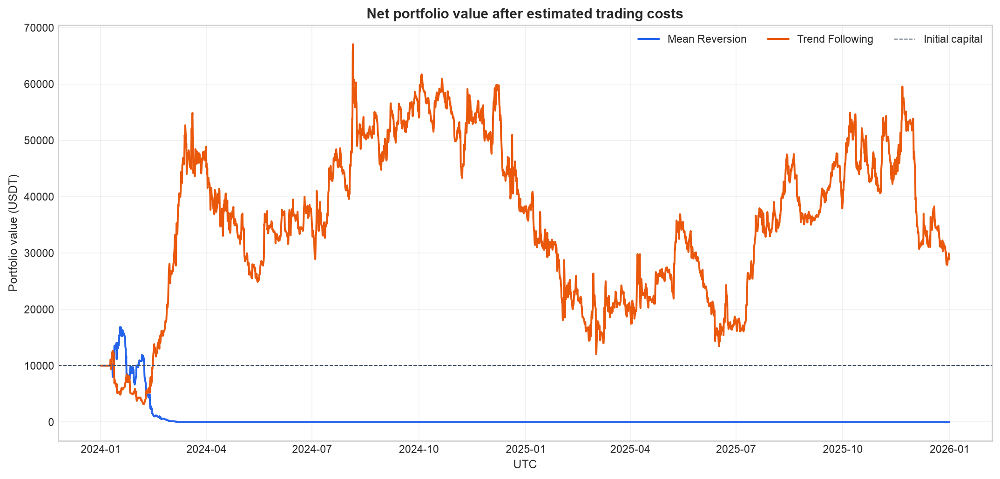
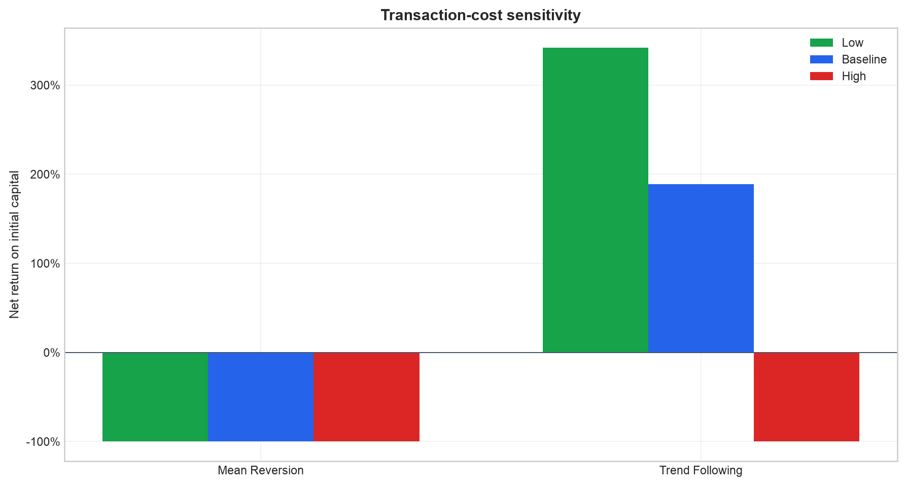
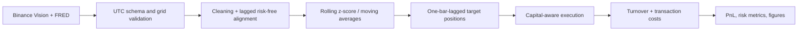

# Crypto Strategy Backtester

[](https://github.com/charlestang1104-hue/crypto-strategy-backtester/actions/workflows/ci.yml)
[](https://www.python.org/)
[](tests/)
[](LICENSE)

A reproducible, cost-aware Python research framework for testing mean-reversion and trend-following
rules on 6-hour cryptocurrency data - with explicit anti-lookahead timing, turnover, holdout analysis,
tests, CLI automation, and honest failure reporting.

> **Research only.** This repository is not investment advice, a live-trading system, or evidence of
> future profitability. The full-sample winner has an 82.1% maximum drawdown and fails in the
> illustrative holdout.



| Research scope | Value |
|---|---:|
| Assets | BTCUSDT, ETHUSDT, BNBUSDT |
| Sample | 2024-01-01 to 2026-01-01 UTC |
| Observations | 2,924 six-hour bars per asset |
| Strategies | Rolling z-score mean reversion; fast/slow MA trend following |
| Initial capital / gross cap | 10,000 / 100,000 USDT |

## Why this project

Backtests are easy to overstate. This repository makes the uncomfortable parts inspectable:

- every executable position uses a one-bar signal lag;
- turnover and modeled costs are first-class outputs;
- low, baseline, and high cost scenarios are reported together;
- the failed strategy and failed holdout are committed, not hidden;
- raw data stays out of Git and is rebuilt from attributed public sources;
- 19 unit, integration, CLI, and regression tests run without market-data network access.

## Results

Baseline cost is the mean per-asset Roll-style estimate, **0.1147% per unit traded**. Return and risk
must be read together.

| Evaluation | Strategy | Net return | Sharpe | Max drawdown | Final value |
|---|---|---:|---:|---:|---:|
| Full sample | Mean reversion | -100.00% | -0.680 | -100.00% | 0 USDT |
| Full sample | Trend following | +188.99% | 0.207 | -82.10% | 28,899 USDT |
| Development (2024) | Trend following | +280.69% | 0.604 | -74.84% | 38,069 USDT |
| Illustrative holdout (2025) | Trend following | -100.00% | -1.446 | -100.00% | ~0 USDT |

The key conclusion is not that trend following is profitable. It is that its full-sample profit is
fragile: performance is concentrated in the development year, risk-adjusted quality is weak, the
drawdown is severe, and the fixed rule does not survive the holdout. See the full
[methodology](docs/methodology.md), [limitations](docs/limitations.md), and
[metric tables](artifacts/full_sample_baseline/metrics/performance_summary.csv).



## Reproduce the research

```bash
git clone https://github.com/charlestang1104-hue/crypto-strategy-backtester.git
cd crypto-strategy-backtester && python -m pip install -e ".[dev]"
crypto-backtester reproduce --config configs/full_sample_baseline.yaml
```

Then run the chronological comparison:

```bash
crypto-backtester reproduce --config configs/holdout_evaluation.yaml
```

The first reproduction downloads public Binance Vision klines and the FRED DFF series into the
ignored `data/cache/` directory. Later runs reuse the cache. Generated artifacts are staged and only
published after every metric and figure succeeds, so a failed run leaves the previous artifact set
intact.

## Methodology in one minute



- **Mean reversion:** long below a 40-bar z-score of -1; short above +1.
- **Trend following:** direction of the 8-bar versus 32-bar moving average.
- **No lookahead:** `position[t]` is built from `signal[t-1]`.
- **Costs:** Roll-style lag-1 covariance estimate with 0.5x, 1.0x, and 1.5x scenarios.
- **Risk controls:** 100,000 USDT target gross cap, 10x current-equity execution cap, no negative equity.

## Package and test architecture

```text
src/crypto_backtester/
├── data/                 # download, validation, cleaning
├── strategies/           # independently testable fixed rules
├── backtest.py           # drift, turnover, costs, capital constraints
├── metrics.py            # return, drawdown, Sharpe, Sortino, Calmar
├── plotting.py           # deterministic publication figures
├── pipeline.py           # atomic end-to-end orchestration
└── cli.py                # reproduce, run, validate commands
```

```bash
python -m ruff check .
python -m pytest
```

CI runs both commands on Python 3.11 and 3.12. The integration fixture is synthetic, so tests never
depend on live Binance or FRED availability. The concise
[research walkthrough](notebooks/research_walkthrough.ipynb) reads the tested package and committed
artifacts rather than hiding business logic inside notebook cells.

## Repository map

| Path | Purpose |
|---|---|
| [`configs/`](configs/) | Reproducible full-sample and holdout experiment definitions |
| [`artifacts/`](artifacts/) | Committed metrics, validation metadata, and real figures |
| [`src/crypto_backtester/`](src/crypto_backtester/) | Installable research package and CLI |
| [`tests/`](tests/) | Unit, integration, CLI, and regression coverage |
| [`data/README.md`](data/README.md) | Source attribution, fields, caching, and data policy |
| [`docs/research-report.pdf`](docs/research-report.pdf) | Polished standalone research report |
| [`docs/verification.md`](docs/verification.md) | Final test, package, artifact, privacy, and PDF QA record |

## Limitations

This compact model omits exchange fees, bid-ask dynamics, nonlinear market impact, funding, latency,
partial fills, and survivorship controls. It studies three assets in one short regime. The 2025 split is
illustrative rather than a pristine out-of-sample test because the repository was constructed
retrospectively from an existing full-sample analysis. Read the full [limitations](docs/limitations.md)
before interpreting any metric.

## Data, citation, and license

Market data comes from [Binance Public Data](https://data.binance.vision/); the risk-free proxy is the
[FRED Effective Federal Funds Rate](https://fred.stlouisfed.org/series/DFF). Source data is not covered
by this repository's license and remains subject to provider terms.

Authored code is released under the [MIT License](LICENSE). Citation metadata is available in
[`CITATION.cff`](CITATION.cff). This project is not affiliated with or endorsed by Binance or the
Federal Reserve Bank of St. Louis.
